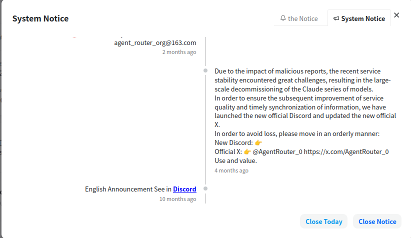
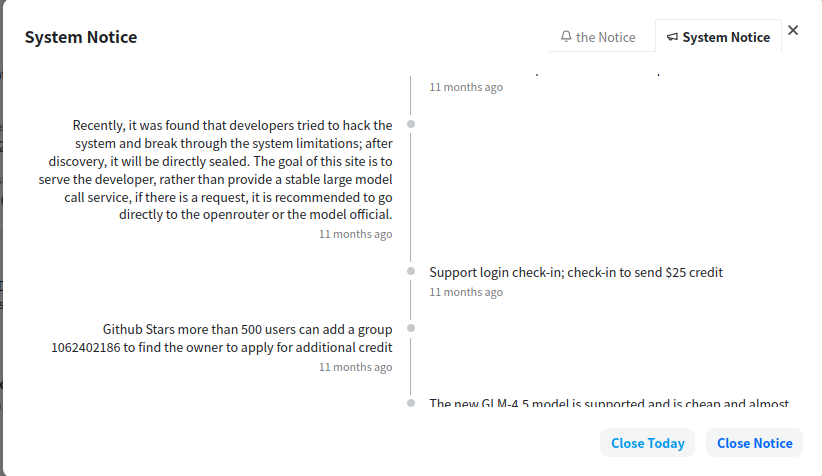
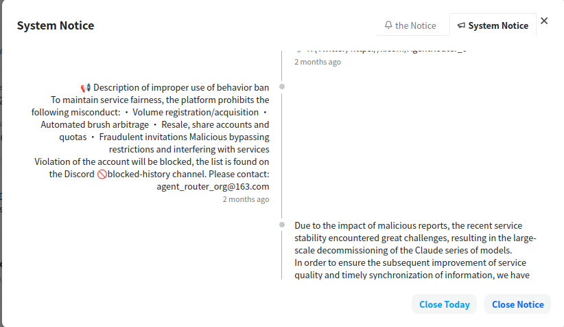
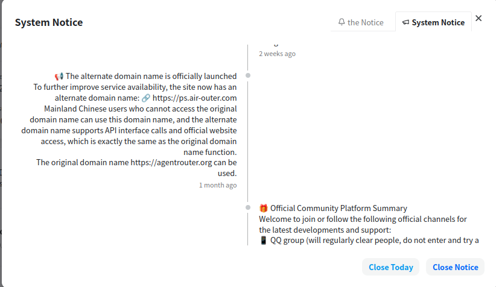
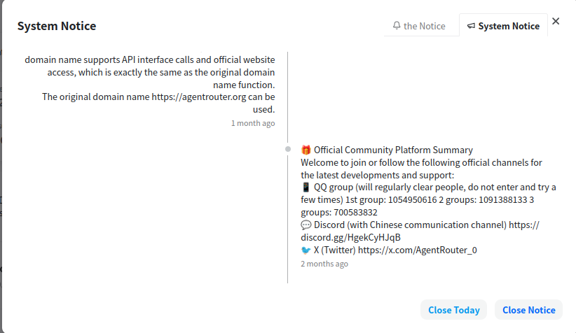
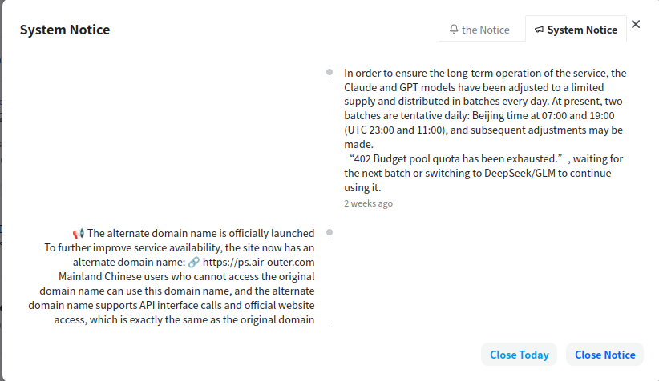
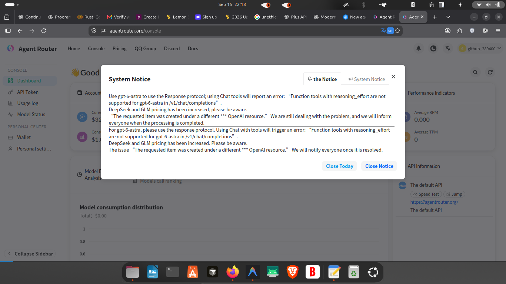
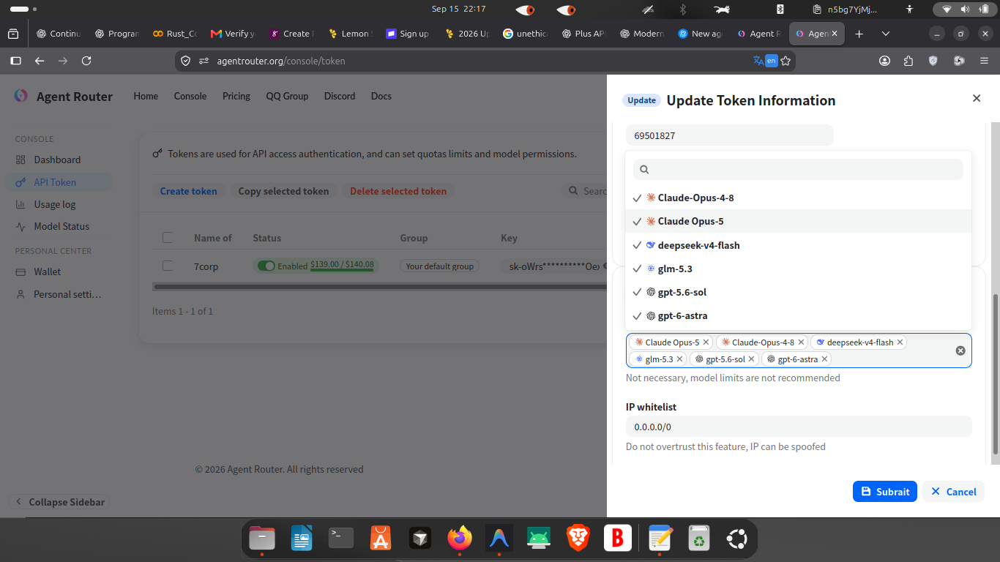

look yh, i need you to look into these:

also possibly you could use playwright and see about its docs, to get full intel: https://agentrouter.org/docs/index.html

YOU SEE AGENTROUTER IS CLEARLY FOR AGENTS, WITH PROPER INTEGRATION YOU CAN MAKE UNIX A GOOD AGENT
